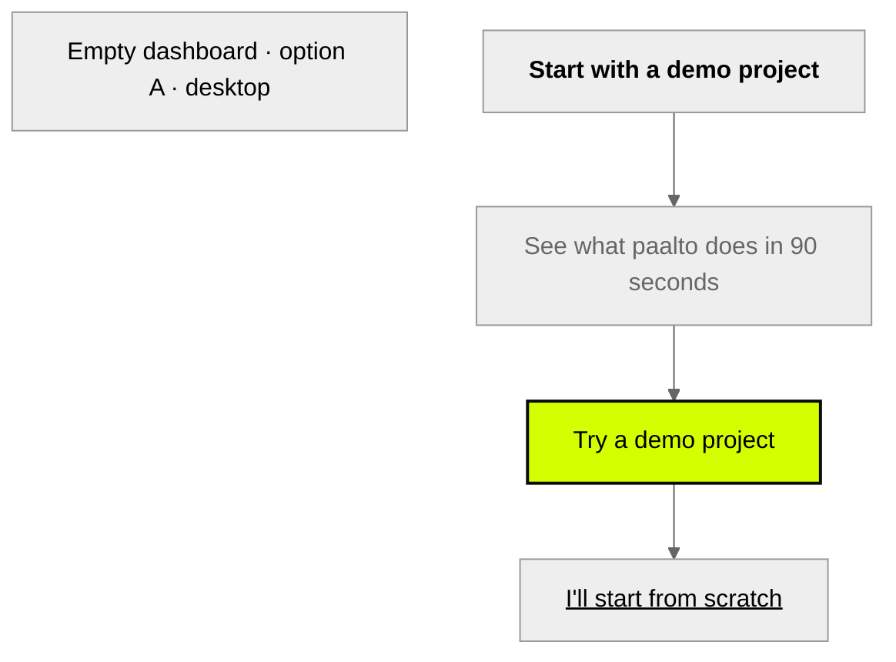
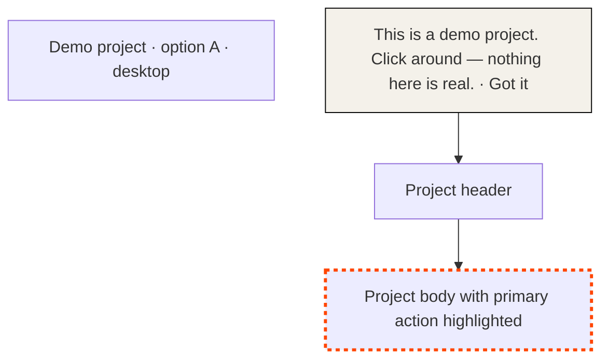

# Wireframes — First-run demo path  *(reference output)*

3 screens × 2 layout options each. Operator picks one option per screen at g3.

## Screen 1 — Empty dashboard (zero projects)

| Screen | Option | Layout idea | Pros | Cons | Recommended |
|---|---|---|---|---|---|
| Empty dashboard | A | Centered hero card: H1 + subhead + primary CTA + secondary link below | Maximises CTA visibility; matches PRD bet "one big button" | Pushes existing app chrome below the fold | **✓** (cites PRD AC: "user with zero projects sees the demo CTA, not the empty `+` panel") |
| Empty dashboard | B | Two-column: hero left, screenshot of a real demo project right | Shows what they're getting | Adds a fetch + load; more places to break for v0 |  |

## Screen 2 — Inside the demo project (first frame)

| Screen | Option | Layout idea | Pros | Cons | Recommended |
|---|---|---|---|---|---|
| Demo project (first frame) | A | Top dismissable banner + pulse highlight on primary action | Non-blocking; users can explore | Easy to dismiss without reading | **✓** (cites synthesis quote: "Click around, break things") |
| Demo project (first frame) | B | Modal overlay tour with 3 steps | Higher chance they see the message | Blocks the thing they came to see; feels like a tutorial |  |

## Screen 3 — After "aha" action

| Screen | Option | Layout idea | Pros | Cons | Recommended |
|---|---|---|---|---|---|
| Post-aha | A | Toast bottom-right with inline "Start a real project" CTA | Lightweight; doesn't interrupt | Could be missed | **✓** (cites PRD AC: `first_run.aha_reached` fires; toast doesn't block) |
| Post-aha | B | Full-width banner above the project | Hard to miss | Pushes content; feels celebratory in a forced way |  |
